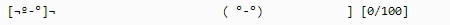
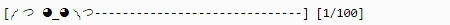
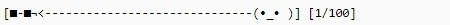
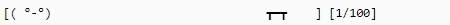
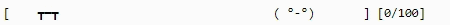
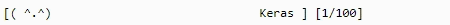
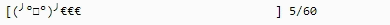
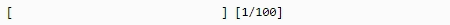
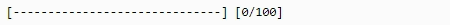

# BARnacle - Flexible and Fun Progress Bars

Barnacle contains progress bars that easily attach themselves to your programs. Use them to fun-up all of your and others' Python applications that require time to execute. It started off as a [Keras plugin (and it still is!)](#keras-plugin) to liven up my deep learning sessions, but has since become more general in scope. 

Get your own Barnacle today!

We have zombies:



Gib:



Sunglasses:



We hate tables:



Tables hate us:



We LOVE Keras:

 [Keras plugin included](#keras-plugin)


Many more presets are available and Barnacle offers the flexibility to design your own as well. Barnacle aims to be a simple rendering engine for progress bars of all types. See the docs (coming soon) on how to easily design your own custom progress bars.

So shut up and take my money already!



(Except it's free forever!!1!)

\* of course we also have customisable regular progress bars (but you don't really care about that, do you?)





# Installation
clone repository, then run setup.py

`python setup.py install`

That's it!

# General Usage
The package is easy to use. Load the module, select a preset, and feed it your progress info. The module takes care of the rest.
```Python
import barnacle #import module

bar = barnacle.random() #either initialize bar object with a random animation
bar = barnacle.preset('zombie') #or with a specific preset (see docs for full list)

for i in range(0, 101): #whatever loop you run
    bar.draw(i, 100) #give it current step, total steps, and the bar draws itself.
    #some time consuming task here
```

`draw` and expects two arguments:
- **currentstep**: The current step that needs to be drawn
- **totalsteps**: The total steps expected to be taken

Alternatively you can also get the bar as a string, in case you want more control:
```Python
for i in range(0, 101): #whatever loop you run
    bar_string = bar.update_bar(i, 100) #give it current step, total steps, and the bar draws itself.
    #now you are free to do anything you want with the string object, print it, eat it, cook it, whatever!
    
    #some time consuming task here
```

Find what presets are available here:
```Python
import barnacle
#what presets are included?
barnacle.print_presets()
```

# Keras Plugin
Barnacle started off as a Keras plugin to make my long model fitting hours more bearable. This functionality is still available. Usage is also simple:

```Python
import keras #import keras first
from barnacle import barnacle_keras #import barnacle keras plugin

#you can select a preset and mode
barnacle_keras.Progbar.preset = 'tableflip' #see docs for full list of presets, 'random' for random
barnacle_keras.Progbar.random = True #whether to select a random progress bar every epoch

#override Keras progbar class in memory
keras.callbacks.Progbar = barnacle_keras.Progbar

#build your model and fit as you usually would
```

# To do:
- [ ] fix 'character icon' not showing properly in the simple_objectslider
- [ ] make readthedocs.io documentation
- [ ] make progress counter settable: percentages, steps, custom, disable
