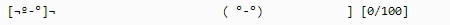
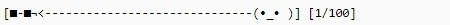
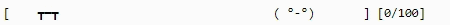
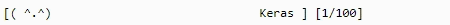
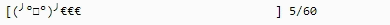
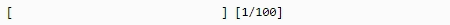
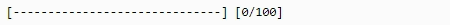

.. Barnacle documentation master file, created by
   sphinx-quickstart on Wed Mar  6 20:16:34 2019.
   You can adapt this file completely to your liking, but it should at least
   contain the root `toctree` directive.

Welcome to Barnacle's documentation!
====================================
Barnacle offers fun and customisable progress bars for your Python programs. Use them to fun-up all of your and others' Python applications that require time to execute. It started off as a Keras plugin (and it still is!) to liven up my deep learning sessions, but has since become more general in scope.

Get your own Barnacle today!

We have zombies:

Gib:

.. image:: images/Gib.gif

Sunglasses:

We hate tables:

.. image:: images/Tableflip.gif

Tables hate us:

We LOVE Keras:

:ref:`kerasplugin` included

What else?
~~~~~~~~~~
Many more presets are available and Barnacle offers the flexibility to design your own as well. Barnacle aims to be a simple rendering engine for progress bars of all types. See the docs (coming soon) on how to easily design your own custom progress bars.

So shut up and take my money already!

(Except it's free forever!!1!)

~~~~~~~~

\* of course we also have customisable regular progress bars (but you don't really care about that, do you?)

~~~~~~~~

.. toctree::
   :maxdepth: 2
   :caption: Index

   quickstart
   makeyourown
