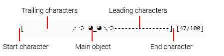

*******************************
Designing a custom progress bar
*******************************

Barnacle offers the ability to easily design your own pogress bar. This section of the documentation details how this works.

Types of bars available
=======================
Several types of progress bars are available, and each can be customised. The types are:

- Simple objectslider
- Animated objectslider
- Interaction objectslider
- Textscroller
- Standard progressbar

Simple objectslider
===================
The `class: simple_objectslider` that will slide a defined object across the progress bar, with settable leading and trailing characters and possible animations. As an example of the simplest form, consider this preset:

Example 1:
~~~~~~~~~~
.. image:: images/Gib.gif

This bar is built from several parts:

To define this progress bar, a standardised :code:`dict{}` object is used (the 'start' and 'end' characters are left to their default values:

.. code-block:: python

    {'icons': ['༼ つ ◕_◕ ༽つ', '༼ つ ◕_◕ ༽つ', ' ', '-']}
	 
	 
This dictionary contains a list of icons from which the progress bar will be built up. The icons need to be in the correct order, which is:

- :code:`icons`: a list containing four elements at fixed indices: 

0. the object to slide across the progress bar
1. the end-state of the object (what it looks like when it reaches the end of the progress bar)
2. trailing character: what to draw behind the object, use ' ' for blank
3. leading character: what to draw in front of the object, use ' ' for blank

So to use this progress bar, simply do:

.. code-block:: python

	import barnacle
	import time
	
	bar = barnacle.simple_objectslider()
	
	custom_bar = {'icons': ['༼ つ ◕_◕ ༽つ', '༼ つ ◕_◕ ༽つ', ' ', '-']}
	bar.load(custom_bar)
	
	for i in range(0,51):
		bar.draw(i, 50) #update bar each step
		time.sleep(0.2) #simulate time consuming loop
	

Example 2:
~~~~~~~~~~
As an example of the extra arguments in the dictionary, consider this preset:

Several things are happening here:

- The dude moving across the bar sometimes whistles
- A table is at the end of the bar
- When the dude reaches the end of the bar the table is flipped and the dude throws up his arms
- For example's sake let's use a custom bar terminator and custom trailing character

The preset dict is defined as: 

.. code-block:: python

    {'icons': ['( °-°) ', '(╯°□°)╯', '.', ' ', '( °-°)♪'],
    'target_icons': ['┳━┳    ', ' ~~ ┻━┻ '], 'extra_odds': 0.2,
	'start': '<', 'end': '>'}
	 

Several arguments are in the dict:

- just like before, :code:`icons`: a list containing four elements at fixed indices: 

0. the object to slide across the progress bar
1. the end-state of the object (what it looks like when it reaches the end of the progress bar)
2. trailing character: what to draw behind the object, here we use '.' for the example's sake
3. leading character: what to draw in front of the object, use ' ' for blank
4. **extra**: the 'extra_icon', the dude whistling

- :code:`target_icons`: list containing two objects to be placed at the end of the progress bar. The elements are:

0. target object default state: while the bar is progressing this is drawn (here: normal table)
1. target end state, when the bar reaches the last step, this is drawn in stead of the 0th index

- :code:`extra_odds`: the odds that the last element in 'icons' is drawn when the :draw(): method is called (here: dude whistling). Needs to be 0 <= extra_odds <= 1.0, with 0.5 representing a 50% chance each draw update.
- :code:`start`: the start character of the bar
- :code:`end`: the end character of the bar

Full example:

.. code-block:: python

	import barnacle
	import time
	
	bar = barnacle.simple_objectslider()
	
	custom_bar = {'icons': ['( °-°) ', '(╯°□°)╯', '.', ' ', '( °-°)♪'],
				  'target_icons': ['┳━┳    ', ' ~~ ┻━┻ '], 'extra_odds': 0.2,
				  'start': '<', 'end': '>'}
	bar.load(custom_bar)
	
	for i in range(0,51):
		bar.draw(i, 50) #update bar each step
		time.sleep(0.2) #simulate time consuming loop
		
		
Docs on other bar types coming ASAP
===================================